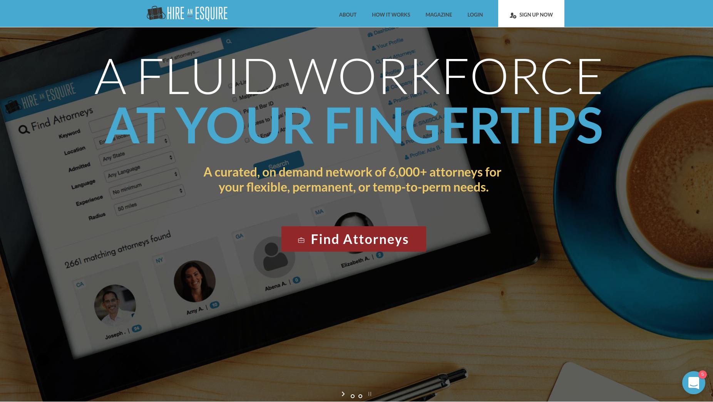
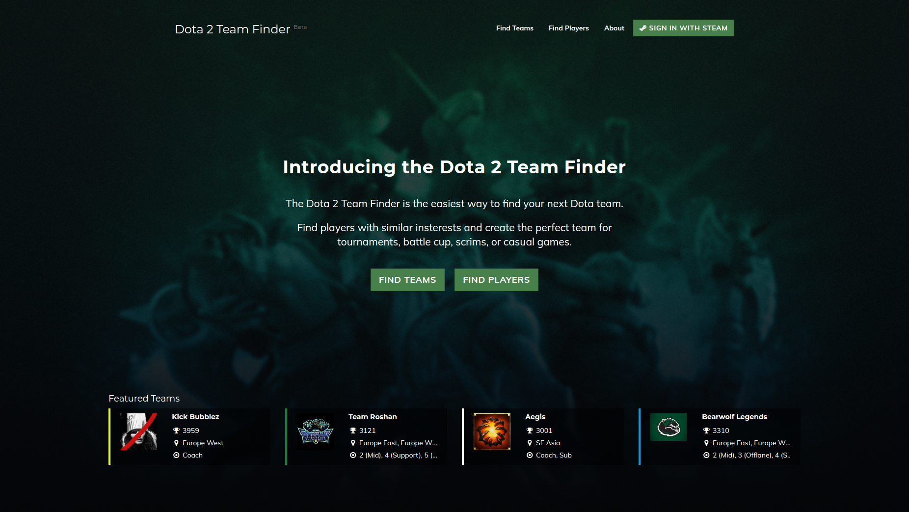
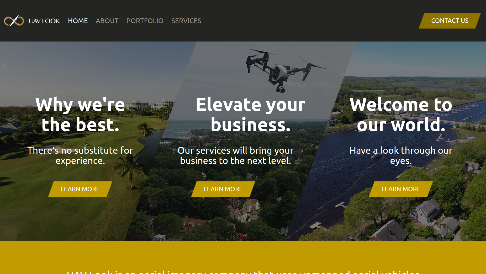

# Work

## Hire an Esquire

> CTO

Legal SaaS - Hire an Esquire connects legal practices with their ideal attorneys using machine learning and 
automation. Responsible for building and evolving the core product and managing a team of 2 developers.

## dotateamfinder.com

> Creator

The Dota 2 Team Finder aims to connect players with similar insterests together to form competitive teams.

<a href="https://github.com/prattl/teamfinder" target="_blank">
    View code on Github
</a>

## wepickheroes.com

> Technical Advisor

We Pick Heroes is the first amateur Dota 2 competitive league of its kind. Responsible for building first iteration 
of web platform.

<a href="https://github.com/wepickheroes/wepickheroes" target="_blank">
    View code on Github
</a>

## UAV Look

> Web Developer

<a href="https://github.com/prattl/uavlook" target="_blank">
    View code on Github
</a>

# Tech

## Frontend

* React
  * Redux
* ES6
* Flow
* GraphQL
* Webpack

## Backend

* Python / Django
* Docker

# About

# Contact

[lenny@prettdev.net](mailto:lenny@prattdev.net)
